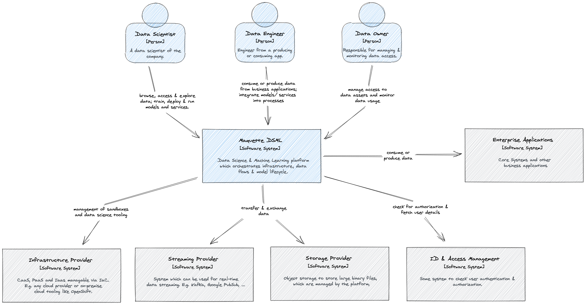
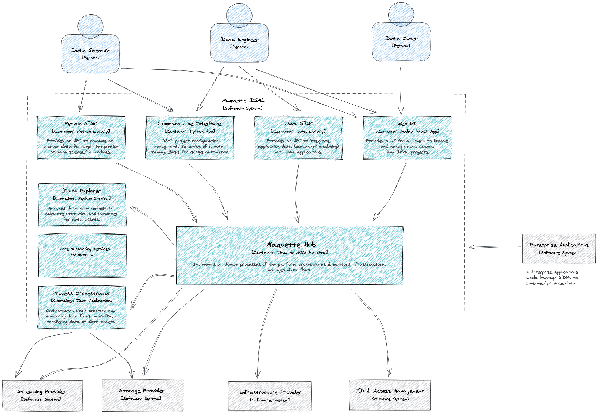

# Architecture Overview

## System Context

The system context depicts the high-level context of the Maquette DSML, including its major users and required out-of-scope systems for the platform.

---

## System Containers

The container diagram shows the high-level shape of the software architecture and how responsibilities are distributed across itself. Each container shows its major technology choice and the flow of control between the containers.

---
Drawings are created with [Excalidraw](https://excalidraw.com/). The SVG files used in the documentation can be loaded into Excalidraw for further editing.