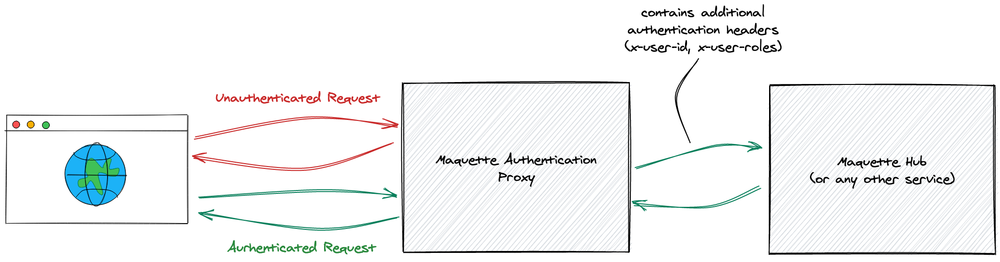

# Maquette Authentication Proxy

This is a simple authentication proxy which can be used for demo purposes to mock a real authentication reverse proxy like [OAuth2 Proxy](https://github.com/oauth2-proxy/oauth2-proxy).

The user management is quite simple: Any try to login will be successful. If the username matches a known user from the configuration, this user object will be used (including user details like user roles, name). If no known user matches, a default user object will be used.

## Get Started

To start the proxy run the following commands:

```
$ cd service
$ npm install
$ PORT=3030 PROXY_URL=${PROXY_URL} npm run start
```

The `PORT` and the `PROXY_URL` environment variables are optional and can also be set within the `service/config.json`.

## What it does



The proxy checks every request whether a user has been already authenticated (simply by using cookies). If the user is not authenticated it will show up a login screen. If the user is authenticated, the request is forwared/ proxied to the actual service. The request might also be directly forwarded if the request already contains technical authentication tokens (e.g. used by CLI, SDKs), see `allowed-authorization-headers` configuration.

The login mechanism is pretty simple. The 'user directory' is configured in the `service/config.json`. If a user logs in with the right name the related user configuration will be applied. If the submitted username is not in the directory, a default user is applied. The password is not checked.

*The proxy should only be used for demonstration purposes, not for a real world system.* In a real system the proxy must be replaced with an enterprise authentication provider.

## Configuration 

You may configure additional settings in `service/config.json`. The following configurations are available.

* **proxy-url** - The target base url of the proxy. Can be overriden by environment variable `PROXY_URL`.
* **port** - The port for the proxy server to listen. Can be overriden by environemnt variable `PORT`.
* **user-id-header** - The name of the HTTP header which is used to add the user id to the forwarded request.
* **user-roles-header** - The name of the HTTP header which is used to add the user's roles to the forwarded request.
* **user-details-header** - The name of the HTTP header which is used to add the user details (the whole user JSON object) to the forwarded request.
* **allowed-authorization-headers** - List of header names which are accepted as a valid authentication. If one of these headers is already included in the request, the request will not be enriched with information from the current session, nor will the request be redirected to the login page if no session is active.
* **users** - An array of known users.
* **routes** - A map/ dictionary to route requests with a matching URI request to another target host than the default `proxy-url`.

## API Endpoints

`POST /login`
The target of the login form. Will authenticate the user and starts a new session.

`POST /impersonate`
Can be used to change the logged in user via a single API request (mainly used for impersonate feature of Demo UIs).

```bash
$ curl \
    --request POST 'http://localhost:3030/impersonate' \
    --header 'Content-Type: application/json' \
    --data-raw '{"username": "alice"}'
```

`GET /logout`
Will delete the current user session to logout the user.

`GET /api/auth/user`
Returns the currently logged in user as JSON object.

`GET /api/auth/users`
Returns the list of known users.

All other requests will be authenticated and forwarded to the target host. If no user session is active, the login page will be rendered.

# Development

## Build & Deploy UI

The UI implementation can be found in the `app` directory. It's a simple [Create React App](https://reactjs.org/docs/create-a-new-react-app.html). To integrate changes from the UI project in the service, execute the following commands:

```
$ cd app
$ npm run build
$ cd ..

$ rm -rf service/public
$ mv app/build service/public
```
